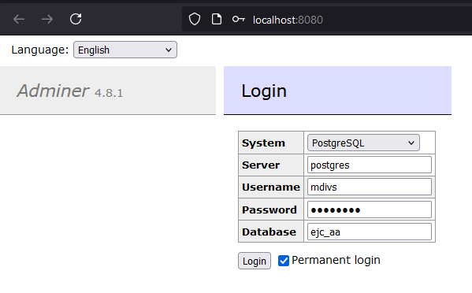

[back to devlopment process](./../../DEVELOPMENT_PROCESS.md)

# __Setup Postgres within Docker__

## __Docker containers setup__

Change the parameters in the code below to better reflect the business needs of your database. Keep in mind that those parameters are needed to connect to the database.

1. Create Postgres server
    ```
    docker run --name user_handler_database -e POSTGRES_USER=admin -e POSTGRES_PASSWORD=12345678 -e POSTGRES_DB=main -p 5432:5432 -d postgres
    ```
    
2. Create postgres client server
    ```
    docker run --name user_handler_adminer -p 8080:8080 --link user_handler_database:postgres -d adminer
    ```

## __Postgres access__
Once the containers are ready, the postgres server can be accessed by

1. Access <a href="http://localhost:8080" target="_blank">http://localhost:8080</a>

2. Insert the provided data into the formulary, example:

    |    Field    |    Value    |
    |-------------|-------------|
    | System      | PostgreSQL  |
    | Server      | postgres    |
    | Username    | mdivs       |
    | Password    | 81655127    |
    | Database    | ejc_aa      |

